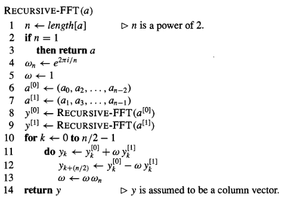

# Algoritmos para la FFT

### Algoritmo de Cooley-Tukey

Siguiendo la discusión anterior sobre la complejidad algorítmica de FFT, llegamos al algoritmo más representativo para la FFT. El algoritmo de Cooley-Tukey (en honor a J.W. Cooley y John Tukey) es recursivo y fue inventado alrededor de 1805 por Carl Friedrich Gauss en el intento de interpolar las trayectorias de los asteroides Pallas y Juno. Sin embargo, Gauss no analizó la complejidad asintótica del algoritmo. Serían James Cooley de IBM y John Tukey de Princeton quienes, en 1965, publicaron un artículo reinventando el algoritmo y describiendo como ponerlo en funcionamiento en un ordenador.

#### Algoritmo Radio-2 DIT

Es la forma más simple y común del algoeritmo de Cooley-Tukey. Radio-2 DIT descompone un secuencia de N puntos (N potencia de 2) en dos secuencias de longitud N/2 y se obtiene la DFT de los N puntos en términos de las DFTs de las dos subsecuencias. Este proceso se repite recursivamente hasta que se obtienen secuencias de sólamente dos puntos. Aquí se muestra un ejemplo de particionado ([@fft-algo]):

Para $k = 0,1,...,N-1$,

$$X^F(k) = \sum_{n=0}^{N-1} x(n) W_{N}^{nk} = \sum_{n \text{ par}} x(n) W_{N}^{nk} + \sum_{n \text{ impar}} x(n) W_{N}^{nk}  = \sum_{r=0}^{N/2-1} x(2r) W_{N}^{2rk} +  \sum_{r=0}^{N/2-1} x(2r+1) W_{N}^{(2r+1)k} = $$ $$ =\sum_{r=0}^{N/2-1} x(2r) (W_{N}^{2})^{rk} +  W_{N}^k\sum_{r=0}^{N/2-1} x(2r+1) (W_{N}^{2})^{rk}$$

Nótese que

$$ W_N^2 =\exp\left[\frac{-j2(2\pi)}{N}\right] = \exp\left(\frac{-j2\pi}{N/2}\right) = W_N/2$$

$$X^F(k) = \sum_{r=0}^{N/2-1} x(2r) (W_{N}^{2})^{rk} +  W_{N}^k\sum_{r=0}^{N/2-1} x(2r+1) (W_{N}^{2})^{rk} = G^F(k) + W_N^k H^F(k), \hspace{1cm} k=0,1,...,N/2 - 1$$

Aquí $X^F(K)$ los N puntos de la DFT de $x(n)$ es expresada en términos de DFTs de N/2 puntos, $G^F(k)$ y $H^F(k)$, que son las DFTs de las instancias pares e impares de $x(n)$ respectivamente.

$X^F(k):$ es periódica con perido N ($X^F(k) = X^F(k+N)$
$G^F(k), H^F(k):$ periódicas con periodo N/2.

$$X^F(k) = G^F(k) +  W_N^kH^F(k) \hspace{1cm} k=0,1,..,N/2 -1  \hspace{1cm} (a)$$
$$X^F(k+N/2) = G^F(k) + W_N^{k+N/2}H^F(k)$$
$$W_N^{N/2} = \exp(-j\pi)=-1$$

Como $W_N^{k+N/2} = - W_N^k$, tenemos que
$$X^F(k+N/2) = G^F(k) - W_N^kH^F(k), \hspace{1cm} k=0,1,...,N/2 -1 \hspace{1cm} (b)$$

Las ecuaciones (a) y (b) se expresan como una mariposa en la siguiente imagen:

Veamos ahora el algoritmo en pseudocódigo:

El algoritmo funciona como sigue: Líneas  2-3 representan el caso base de la recursión. La DFT de un elemento es el propio elemento:
$$y_0 = a_0 \omega_1^0 = a_0$$

Las líneas 6-7 definen los vectores de coeficientes
