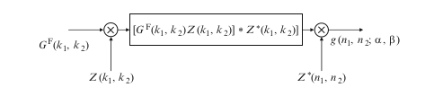
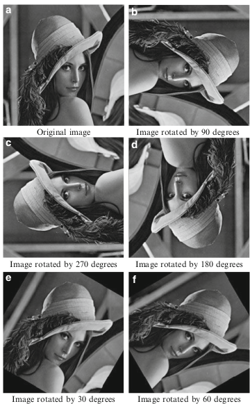
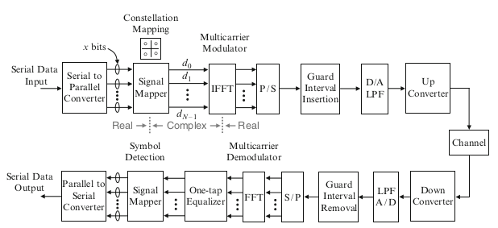
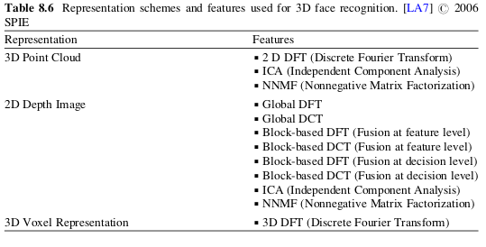
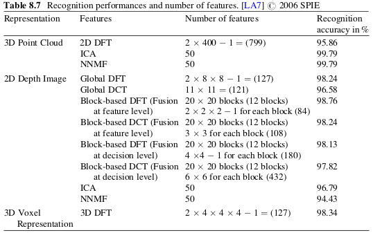

# Aplicaciones de la FFT

En la siguiente sección enunciamos brevemente algunas aplicaciones de la FFT basándonos en [@fft-algo] y [@apps].

## Rotación y traslación de imágenes

Dada una imagen $x(n_1,n_2)$ en una rejilla cuadrada de dimensiones $N \times N$, computamos $x(n_1,n_2)$ en otra rotada con ángulo $\theta$ en sentido horario y movida mediante una traslación $(m_1,m_2)$ arbitraria. Primero, se computa la FFT 2-D de $x(n_1,n_2)$:
$$X^F(k_1,k_2) = \sum_{n_1=0}^{N-1} \sum_{n_2=0}^{N-1} x(n_1,n_2) W_N^{n_1 k_1+n_2 k_2} \hspace{0.2 cm} k_1,k_2 = 0,1,\dots,N-1$$
$$ x(n_1,n_2) = \frac{1}{N^2}  \sum_{n_1=0}^{N-1} \sum_{n_2=0}^{N-1}X^F(k_1,k_2) W_N^{-(n_1 k_1+n_2 k_2)} \hspace{0.2 cm} k_1,k_2 = 0,1,\dots,N-1$$
donde $W_N = exp(-j2\pi/N)$.

Ahora calculamos la imagen $x(n_1,n_2)$ en la cuadrícula deseada de salida.

$$x(n_1 \cos \theta - n_2 \sin \theta + m_1, n_1 \sin \theta + n_2 \cos \theta +m_2) = $$ $$= \frac{1}{N^2}  \sum_{n_1=0}^{N-1} \sum_{n_2=0}^{N-1}X^F(k_1,k_2) exp[\frac{j2\pi}{N}(k_1 m_1 + k_2 m_2)] exp[\frac{j2\pi}{N}(k_1 n_1 + k_2 n_2)\cos \theta]$$ $$ \times exp[\frac{j2\pi}{N}(k_2 n_1 - k_1 n_2) \sin \theta] \hspace{1cm} (*)$$  

Para calcular (*), necesitamos computar la siguiente suma

$$g(n_1,n_2; \alpha, \beta) = \sum_{k_1=0}^{N-1} \sum_{k_2=0}^{N-1} G^F(k_1,k_2) exp(j2\pi[(k_1 n_1 + k_2 n_2) \alpha + (k_2 n_1 - k_1 n_2) \beta]) $$

para $\alpha, \beta$ arbitrarios (en este caso, $\alpha = \frac{\cos \theta}{N}, \beta = \frac{\sin \theta}{N}$), donde
$$G^F(k_1,k_2) = \frac{1}{N^2} X^F(k_1,k_2)exp[\frac{j2\pi}{N}(k_1 m_1 + k_2 m_2)]$$

Con todo esto, podemos escribir 
$$g(n_1,n_2;\alpha, \beta) = Z^{*}(n_2,n_1) \sum_{k_1=0}^{N-1} \sum_{k_2=0}^{N-1} \{G^F(k_1,k_2) Z(k_1,k_2)\} Z^{*}(k_1-n_1,k_2+n_2) $$

donde $Z(n_1,n_2) = exp(j \pi((n_1^2-n_2^2) \alpha +2n_1 n_2 \beta)), G^F(k_1,k_2)$  se define como antes y * denota el conjugado complejo. Todo esto implica dos multiplicaciones y una convolución, que se pueden llevar a cabo usando FFTs 2-D (figura de debajo [@fft-algo]) 

## OFDM

OFMD/COFDM (orthogonal frequency domain multiplexing) ha sido adoptado en Europa para la retransmisión de la TDT y HDTV. Nuestra intención es decribir la aplicación de FFT en este sistema.

### Representación de la señal OFDM usando FFT

Denotamos los puntos de señal correspondientes a la señales de información en los $N/2$ subcanales como
$$ \hat{d_n} = \hat{a_n} + j \hat{b_n} \hspace{1cm} n = 0,1,\dots,N/2 -1$$

donde $\hat{a_n}, \hat{b_n}$ toman valores $\pm 1, \pm 3,\dots$ dependiendo del número de puntos de señal en la constelación de señales (figura anterior).  
Dado que $y(t)$ debe ser real, creamos N símbolos a partir de los N/2 símbolos de información.  
$$ d_0 = \operatorname{Re}(\hat{d_0}) $$
$$d_{N/2} = Im(\hat{d_0}) $$
$$d_n = \hat{d_n} \hspace{1cm} n = 1,2,\dots,N/2-1$$
$$d_{N-n}=(d_n)^{*} \hspace{1cm} n = 1,2,\dots,N/2-1$$

La DFT de la secuencia de datos complejos $d_n = a_n +j b_n$ es 

$$ X^F(k) = \sum_{n=0}^{N-1} d_n W_N^{nk} \hspace{0.7cm} k = 0,1,\dots,N-1$$
$$ =  \sum_{n=0}^{N-1} d_n exp(-j2\pi f_n t_k)$$

donde $f_n = \frac{n}{N\Delta t}, t_k = k \Delta t$, y $\Delta t$ es la duración de $d_n$,  

$$X^F(k) = \sum_{n=0}^{N-1} (a_n+jb_n)[\cos(2\pi f_n t_k) - j \sin(2\pi f_n t_k)]$$

De la asunción de que $y$ es real, los términos imaginarios de $X^F(k)$ se cancelan dando lugar únicamente a la parte real de $X^F(k)$

$$Y^F(k) = \operatorname{Re}[X^F(k)] = \sum_{n=0}^{N-1} [a_n \cos(2\pi f_n t_k) + b_n \sin(2\pi f_n t_k)]$$

Finalmente,
$$y(t) = \sum_{n=0}^{N-1} [a_n \cos(2\pi f_n t_k) + b_n \sin(2\pi f_n t_k)] \hspace{0.5cm} 0 \leq t \leq N \Delta t$$

## Reconocimiento facial tridimensional

Varias técnicas basadas en proyección de características usando DFT ([@LA7]) se aplican para registrar escáneres 3D de caras para reconocimiento facial. Estas técnicas de extraccińo de características se aplican en tres representaciones diferentes, llamadas 3D point clouds, imágenes profundas 2D y 3D voxel.  
Usando una base de datos facial 3D-RMA, Dutagaci, Sankur y Yemez ([@LA7]) han llevado a cabo un reconocimiento de varios esquemas. La base de datos contiene el escáner facial de 106 sujetos. Los datos obtenidos son los siguientes ([@LA7]).

\newpage
