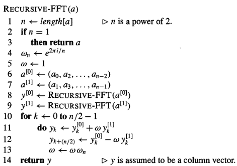

# La Transformada de Fourier rápida

## Complejidad algorítmica

En esta sección inicial introducimos el concepto de complejidad de un algoritmo.

El campo de la complejidad algorítmica dentro de la informática teórica intenta estudiar cuántos recursos necesita un cierto algoritmo para calcular una función. Nos centramos en la medida más común que consiste en medir la cantidad de pasos que necesita un algoritmo en el peor caso para cada tamaño de entrada.

En primer lugar recordamos la definición de la notación O-grande.

:::{.definition}
Sea $T : \mathbb{N} \to \mathbb{N}$,

$T(n)$ es $O(f(n)) \Leftrightarrow \exists c \in \mathbb{R}, \exists n_0 \in \mathbb{N}$, tal que $\forall n \geq n_0, T(n) \leq c f(n)$
:::

A continuación describimos el concepto de calculabilidad en tiempo $O(f(n))$ (clásico) de una función.
En general nos restringimos a funciones con dominio y codominio formado por palabras (vectores) en el alfabeto $\{0,1\}$, esto es, sobre
$$\{0,1\}^\ast = \bigcup_{n \in \mathbb{N}\cup \{0\}} \{x_1 \dots x_n \;:\; x_i \in \{0,1\}\}$$
Dada una palabra $x \in \{0,1\}^\ast$ decimos que su longitud es $n$, notado $|x| = n$, si $x = x_1 \dots x_n$.

Así llegamos a la siguiente definición:

:::{.definition #dfn:calcu}
Sea $f: \{0,1\}^\ast \to \{0,1\}^\ast$, $T: \mathbb{N} \to \mathbb{N}$. 
Un algoritmo (clásico) *calcula $f$ en tiempo* $O(T(n))$ si, la función que asocia a cada $n$ el máximo número de pasos que toma el algoritmo para calcular $f(x)$ con $|x| = n$ es $O(T(n))$.

Un algoritmo (clásico) *calcula $f$ en tiempo polinómico (clásico)* si lo calcula en tiempo $O(T(n))$ con $T$ un polinomio.
:::

Para aplicar con rigor la [@dfn:calcu] es necesario proporcionar una representación de la entrada y salida como palabras en el alfabeto $\{0,1\}$. En los casos en los que esta representación esté omitida la eficiencia de algoritmo será independiente de tal representación.

## Representación de polinomios

En esta pequeña introducción se presentan dos formas de representar polinomios: por medio de sus coeficientes y por parejas punto-valor (un punto y su evaluación en el polinomio). Atacaremos el problema de multiplicar polinomios de grado acotado por $n$, consiguiendo, a través de FFT, un algoritmo de orden $O(n \log n)$. El contenido está basado en el capítulo 30 de [@introAlgorithms].

### Representación mediante coeficientes

La representación mediante coeficientes de un polinomio $A(x) = \sum_{j=0}^{n-1} a_j x^j$ de grado acotado por $n$ es un vector de coeficientes $a=(a_0,a_1,\dots,a_{n-1})$. Esta representación es interesante para ciertas operaciones tales como la **evaluación** (mediante la regla de Horner, tomando un tiempo $O(n)$) o la suma de polinomios, ya que si

$$a=(a_0,a_1,\dots,a_{n-1}),b=(b_0,b_1,\dots,b_{n-1}) \Rightarrow c = (c_0,c_1,\dots,c_{n-1}): c_j = a_j+b_j$$

calculándose en un tiempo de $O(n)$.

Sin embargo, si se considera la multiplicación entre dos polinomios $A(x)$ y $B(x)$ de grado menor o igual que n a través de la representación mediante coeficientes, aplicando la propiedad distributiva del producto respecto de la suma (convolución de los coeficientes), el tiempo necesario asciende a $O(n^2)$, siendo muy costoso. Como la multiplicación de polinomios y el cálculo de convoluciones es una cuestión fundamental en este trabajo, es necesario encontrar alternativas más eficientes.

### Representación punto-valor

La representación punto valor de un polinomio $A(x), \deg(A) \leq n$ es un conjunto de n pares punto-valor

$$\{(x_0,y_0),(x_1,y_1),\dots,(x_{n-1},y_{n-1})\}$$

de forma que cada $x_k$ es distinto y $y_k = A(x_k)$ para $k=0,1,\dots,n-1$

El cálculo de la representación punto-valor de un polinomio dado en su representación mediante coeficientes es inmediata ya que basta con seleccionar $n$ puntos distintos $x_0,x_1,\dots,x_{n-1}$ y evaluarlos en $A(x)$. Con la regla de Horner, esa evaluación es del orden de $O(n^2)$ Veremos que si se seleccionan los $x_k$ cuidadosamente el algoritmo se acelera hasta $O(n \log n)$.

Determinar los coeficientes de un polinomio dado en su representación punto-valor es un proceso llamado **interpolación**. El siguiente teorema asegura que la interpolación es una operación bien definida.

:::{.theorem #thm:interpolación}
Para todo conjunto $\{(x_0,y_0),\dots,(x_{n-1},y_{n-1})\}$ de $n$ parejas punto-valor con $x_k$ distintos para todo $k$, existe un único polinomio $$A(x), \deg(A) \leq n  : y_k = A(x_k) \qquad \forall k = 0,\dots,n-1$$
:::
:::{.proof}
La ecuación $y(x_k) = A(x_k)$ es equivalente a la siguiente expresión:

$$
A = \begin{bmatrix}
    1 & x_0 & x_0^2 \dots & x_0^{n-1} \\
    1 & x_1 & x_1^2 \dots & x_1^{n-1} \\
    \vdots & \vdots & \vdots \ddots &  \vdots \\
    1 & x_{n-1} & x_{n-1}^2 \dots & x_{n-1}^{n-1}
    \end{bmatrix}
    \begin{bmatrix}
    	a_0 \\
    	a_1 \\
    	\vdots \\
    	a_{n-1}
    \end{bmatrix} =
    \begin{bmatrix}
    	y_0 \\
    	y_1 \\
    	\vdots \\
    	y_{n-1}
    \end{bmatrix}
$$

La matriz de la izquierda es conocida como la matriz de Vandermonde y sabemos que su determinante es
$$
	\prod_{0 \leq j < k \leq n-1} (x_k-x_j)
$$
y como cada punto es distinto, la matriz es invertible. Por tanto,
$$a = V(x_0,x_1,\dots,x_{n-1})^{-1}y$$
:::

Esta representación es conveniente tanto en sumas como en multiplicación de polinomios, obteniéndose en un tiempo $O(n)$. Sin embargo, hay que tener en cuenta que si $A,B$ son polinomios de grado menor o igual que n y $C=A+B$, entonces $\deg(C)= \deg(A) + \deg(B)$, luego C es un polinomio de grado menor o igual que 2n. Para interpolar el polinomio de acuerdo al teorema anterior se necesitan $2n$ parejas punto-valor, por lo que hay que utilizar representaciones extendidas de cada conjunto de parejas de forma que cada uno contenga $2n$ parejas. Dados dos polinomios con su representación punto-valor extendida, se comprueba que el tiempo necesario para multiplicarlos es del orden de $O(n)$, mucho más rápido que el tiempo necesario para multiplicarlos a través de sus coeficientes.

## Multiplicación rápida de polinomios en forma de coeficientes

¿Es posible utilizar el método de multiplicación de polinomios en su forma punto-valor (tiempo lineal) para acelerar la multiplicación a través de los coeficientes? La respuesta a esta pregunta pasa por analizar nuestra habilidad de evaluar e interpolar polinomios rápidamente.

En principio se podría utilizar cualquier conjunto de puntos para evaluarse, pero seleccionándolos cuidadosamente, podríamos pasar de una representación a otra en tiempo $O(n\log n)$. Si tomamos las raíces complejas de la unidad como puntos a evaluar, podemos generar la representación punto valor con la Transformada Discreta de Fourier (DFT)  de un polinomio dado por sus coeficientes. Como veremos a continuación, la Transformada Rápida de Fourier (FFT) llevará a cabo la DFT y la DFT inversa en tiempo $O(n\log n)$.

Dada la FFT, presentamos el siguiente procedimiento de orden de complejidad $O(n\log n)$ para multiplicar dos polinomios $A(x), B(x)$ de grado menor o igual que n suponiendo que estén en su representación mediante coeficientes. Podemos asumir sin pérdida de generalidad que $n$ es potencia de 2 (esto siempre se puede conseguir añadiendo coeficientes que sean 0).

Extendiendo al doble el grado
: Se crea la representación de $A(x)$ y $B(x)$ como polinomios de grado menor o igual que $2n$ añadiendo $n$ 0 como coeficientes de orden mayor.

Evaluación
: Calcular la representación punto-valor de $A(x)$ y $B(x)$ de longitud $2n$ a través de la aplicación de la FFT de orden $2n$ sobre cada vector. Esta representación contiene los valores de los dos polinomios evaluados en las $2n$ primeras raíces de la unidad.

Multiplicación
: Calcular la representación punto-valor de $C(x)=A(x)B(x)$ multiplicando los valores convenientemente. Esta representación contiene el valor de $C(x)$ en cada $2n$ raíz de la unidad.

Interpolación
: Generar los coeficientes de $C(x)$ mediante la aplicación de una FFT en $2n$ parejas punto-valor para calcular la DFT inversa.

Los pasos (1) y (3) son lineales y los pasos (2) y (4) son de orden $O(n\log n)$. Por tanto, tras mostrar cómo usar la FFT, habremos probado lo siguiente:

:::{.theorem #thm:FFT}
El producto de dos polinomios de grado menor o igual que n representados por sus coeficientes puede ser computado en un tiempo $O(n\log n)$ y la salida vendrá representada por sus coeficientes.
:::

## Complejidad de la FFT

Para darle significado al teorema anterior, nos centramos en estudiar cómo usar la FFT en la evaluación e interpolación de polinomios. Introducimos conceptos ya conocidos pero que serán necesarios.

### Raíces complejas de la unidad

Una raíz n-ésima de la únidad es un número $W$ tal que
$$W^n = 1$$
Hay exactamente $n$ raíces complejas n-ésimas de la unidad: $e^{\frac{2\pi i k}{n}}. k = 0,1,\dots,n-1$

:::{.lemma name='Lema de cancelación'}
Para cualesquiera $n \geq 0$, $k \geq 0$, y $d >0$, siendo $W_{n} = e^{\frac{2\pi i}{n}}$
$$W_{dn}^{dk} =W_{n}^{k}$$
:::

:::{.proof}
Por definición,
$$W_{dn}^{dk} = (e^{\frac{2\pi i}{dn}})^{dk} = (e^{\frac{2\pi i k}{n}})^{k} = W_{n}^{k}$$
:::

:::{.lemma name='Lema de la mitad'}
Si $n>0$ es par, entonces los cuadrados de las $n$ raíces complejas $n$-ésimas de la unidad son las $(n/2)$ raíces complejas $(n/2)$-ésimas de la unidad.
:::

:::{.proof}
Por el lema de cancelación, sabemos que $(W_{n}^{k})^2 = W_{n/2}^{k}$ para todo $k$ entero positivo.  Si elevamos al cuadrado cada raíz $n$-ésima de la unidad, entonces se obtiene dos veces cada raíz $(n/2)$-ésima de la unidad, por tanto, $W_{n}^{k}$ y $W_{n}^{k+n/2}$ tienen la misma raíz.

Como $W_{n}^{n/2} = -1$, entonces $W_{n}^{k+n/2} = - W_{n}^{k}$ y por tanto
$(W_{n}^{k+n/2})^{2} = W_{n}^{2k}$
:::

### La FFT

Nos encontrábamos en la situación de evaluar $A(x) = \sum_{j=0}^{n-1} a_j x^j$ en los puntos $W_{n}^{0}, W_{n}^{1},\dots,W_{n}^{n-1}$. Sin pérdida de generalidad, asumimos que $n$ es potencia de 2 como ya hemos alarado antes. Dado A en su representación por coeficientes, calculamos, para cada $k=0,1,\dots,n-1$
$$y_k = A(W_{n}^{k}) = \sum_{j=0}^{n-1} a_j W_{n}^{kj}$$.

El vector $y=(y_0,y_1,\dots,y_{n-1})$ es la DFT del vector de coeficientes $a = (a_0,a_1,\dots,a_{n-1} (y=DFT_n(a))$.

Sabiendo eso, usamos FFT para computar $\operatorname{DFT}_n(a)$ en tiempo $O(n\log n)$ en vez de $O(n^2)$ con el método directo.
La FFT utiliza un método con estrategia dívide y vencerás, de forma que separa los índices pares de los impares y define dos nuevo polinomios de grado menor o igual que $n/2$, a saber:

$$A^{[0]}(x) = a_0 + a_2x+ a_4x^2 + \dots + a_{n-2} x^{n/2-1},$$
$$A^{[1]}(x) = a_1 + a_3x + a_5x^2 + \dots + a_{n-1} x^{n/2-1}.$$

Se sigue que

$$A(x) = A^{[0]}(x) + x A^{[1]}(x) \label{eqn:def}$$

así que el problema de evaluar A(x) en las $n$ raíces $n$-ésimas de la unidad se reduce a

1. evaluar los puntos $(W_{n}^0)^2,(W_{n}^1)^2,\dots,(W_{n}^{n-1})^2 (*)$ en los polinomios $A^{[0]}(x),  A^{[1]}(x)$.
2. combinar los resultados en la expresión $\ref{eqn:def}$.

Por el lema de la mitad, las raíces (*) no están formadas por $n$ valores distintos si no por las $(n/2)$ raíces complejas $(n/2)$-ésimas de la unidad. Por tanto, los polinomios $A^{[0]}(x)$ y $A^{[1]}(x)$ están evaluando recursivamente las  $(n/2)$ raíces complejas $(n/2)$-ésimas de la unidad.
Presentamos ahora el pseudocódigo del algoritmo tratado ([@introAlgorithms]).

\newpage
En las líneas 2-3 representa el caso base de la recursión, ya que la DFT de un elemento es él mismo.  

Las líneas 6-7 definen los vectores de coeficientes para los polinomios $A^{[0]}, A^{[1]}$. Las líneas 4,5 y 13 garantizan que $W$ se actualiza propiamente. Las líneas 8-9 lleva a cabo el cómputo de $DFN_{n/2}$. Fijando $k=0,1,\dots,n/2-1$
$$y_k^{[0]}=A^{[0]}W_{n/2}^k$$
$$y_k^{[1]}=A^{[1]}W_{n/2}^k$$

Dado que $W_{n/2}^k = W_n^{2k}$ por el lema de cancelación,
$$y_k^{[0]}=A^{[0]}W_n^{2k}$$
$$y_k^{[1]}=A^{[1]}W_n^{2k}$$

Líneas 11-12 combinan los resultados de los cálculos de la $DFT_{n/2}$ recursiva. Para $y_0,y_1,\dots,y_{n/2-1}$, la línea 11 asegura
$$y_k = A(W_n^k)$$

Para $y_{n/2},y_{n/2+1},\dots,y_{n-1}$, fijando $k=0,1,\dots,n/2-1$, la línea 12 asegura (debido a las propiedades de las raíces n-ésimas de la unidad enunciadas)
$$y_{k+n/2} = A W_n^{k+n/2}$$
Por tanto, el vector $y$, salida del algoritmo es la DFT del vector $a$.  

Para determinar el tiempo de ejecución del procedimiento mostrado, notamos que excluyendo las llamadas recursivas, cada invocación toma un tiempo $O(n)$, donde $n$ es la longitud del vector entrada. Por tanto, la recurrencia es del orden
$$T(n) = 2T(n/2)+O(n) = O(n \log n)$$
