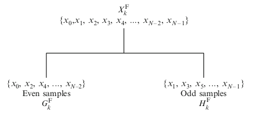
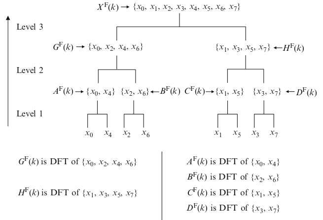
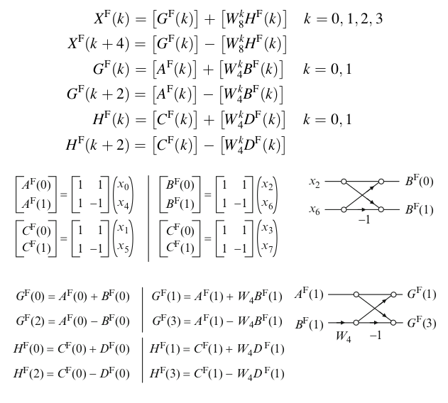

# Algoritmo para la FFT

## Algoritmo de Cooley-Tukey

- Algoritmo recursivo
- Inventado por Gauss en 1805 para interpolar las trayectorias de asteroides
- No analizó la complejidad asintótica
- James Cooley (IBM) y John Tukey (Princeton) en 1965 reinventaron el algoritmo describiendo cómo ponerlo en funcionamiento en un ordenador

## Algoritmo Radio-2 DIT

- Forma simple y común del algoritmo de Cooley-Tukey
- Descompone una secuencia de $N$ puntos en dos secuencias de longitud $N/2$ y se obtiene sus DFTs.
- Este proceso se repite recursivamente hasta que se obtienen secuencias de dos puntos

## Algoritmo Radio-2 DIT

## Algoritmo Radio-2 DIT

