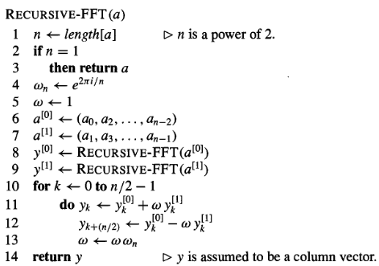

# Complejidad asintótica

## Algunas definiciones previas

:::{.definition name='Notación O-grande'}

Sea $T : \mathbb{N} \to \mathbb{N}$,

$T(n)\text{ es }O(f(n)) \Leftrightarrow \exists c \in \mathbb{R}, \exists n_0 \in \mathbb{N}\text{, t.q. }\forall n \geq n_0, T(n) \leq c f(n)$
:::

:::{.definition name='Calculabilidad'}
Sea $f: \{0,1\}^\ast \to \{0,1\}^\ast$, $T: \mathbb{N} \to \mathbb{N}$.
Un algoritmo (clásico) *calcula $f$ en tiempo* $O(T(n))$ si, la función que asocia a cada $n$ el máximo número de pasos que toma el algoritmo para calcular $f(x)$ con $|x| = n$ es $O(T(n))$.

Un algoritmo (clásico) *calcula $f$ en tiempo polinómico (clásico)* si lo calcula en tiempo $O(T(n))$ con $T$ un polinomio.
:::

## ¿Cómo se pueden representar polinomios?

- Representación mediante sus coeficientes  
- Representación por parejas punto-valor (un punto y su evaluación)

**Cada representación favorece computacionalmente distintas operaciones**

## Representación mediante coeficientes

$\text{Dado un polinomio }A(x) = \sum_{j=0}^{n-1} a_j x^j \text{ de grado menor que } n$ $\text{ su representación por coeficientes es}$

$$a=(a_0,a_1,\dots,a_{n-1})$$

### Operaciones favorecidas

- Evaluación (algoritmo de Horner, calculándose en un tiempo de $O(n)$).  
- Suma de polinomios ($O(n)$)

$a=(a_0,\dots,a_{n-1}),b=(b_0,\dots,b_{n-1}) \Rightarrow c = (c_0,\dots,c_{n-1}): c_j = a_j+b_j$

### Operaciones más costosas

- Multiplicación de polinomios (convolución de sus coeficientes, $O(n^2)$)

## Representación por parejas punto-valor

La representación punto valor de un polinomio $A(x), \deg(A) \leq n$ es un conjunto de n pares punto-valor

$$\{(x_0,y_0),(x_1,y_1),\dots,(x_{n-1},y_{n-1})\}$$

de forma que cada $x_k$ es distinto y $y_k = A(x_k)$ para  $k=0,\dots,n-1$

### Cálculo de la Representación

- Basta con seleccionar $n$ puntos distintos $x_0,x_1,\dots,x_{n-1}$ y evaluarlos en $A(x)$.
  - Algoritmo de Horner ($O(n^2)$)
  - Eligiendo cuidadosamente los $x_k$ se reduce a **$O(n \log n)$**

## Representación por parejas punto-valor

Determinar los coeficientes de un polinomio dado en su representación punto-valor es un proceso llamado **interpolación**.

:::{.theorem #thm:interpolación}
Para todo conjunto $\{(x_0,y_0),\dots,(x_{n-1},y_{n-1})\}$ de $n$ parejas punto-valor con $x_k$ distintos para todo $k$, existe un único polinomio $$A(x), \deg(A) \leq n  : y_k = A(x_k) \qquad \forall k = 0,\dots,n-1$$
:::

## Representación por parejas punto-valor

### Operaciones favorecidas

- Suma y multiplicación de polinomios ($O(n)$)

**Precaución:**
Si $A,B$ son polinomios de grado menor o igual que n y $C=A+B$, entonces $\deg(C)= \deg(A) + \deg(B) \Rightarrow \deg(C) \leq 2n$  
$\Rightarrow$ Para aplicar el teorema anterior se necesitan $\textbf{2n}$ nodos que interpolar...  
$$\centering{\Rightarrow \textbf{Representación punto-valor extendida}}$$

## Multiplicación rápida de polinomios en forma de coeficientes

¿Es posible utilizar el método de multiplicación de polinomios en su forma punto-valor (tiempo lineal) para acelerar la multiplicación a través de los coeficientes? $\Leftrightarrow$ **Evaluar e interpolar polinomios rápidamente.**

- Cualquier conjunto de puntos es válido para evaluar.
- Si se escogen cuidadosamente podríamos pasar de una representación a otra en tiempo $O(n\log n)$
- Si tomamos las raíces complejas de la unidad, podemos generar la representación punto valor con la DFT de un polinomio dado por sus coeficientes  
- FFT llevará a cabo la DFT y la DFT inversa en tiempo $O(n\log n)$

## Multiplicación rápida: Procedimiento de la FFT ($O(n\log n)$)

Si $A(x), B(x)$ polinomios de grado menor o igual que $n$ en su representación por coeficientes, $n$ es potencia de 2, los multiplicamos:

1. Extendiendo al doble el grado
2. Evaluación
3. Multiplicación
4. Interpolación

(1) y (3) son $O(n)$; (2) y (4) son de orden $O(n\log n)$. Por tanto, tras mostrar cómo usar la FFT, habremos probado lo siguiente:

## Multiplicación rápida: Procedimiento de la FFT ($O(n\log n)$)

:::{.theorem #thm:FFT}
El producto de dos polinomios de grado menor o igual que n representados por sus coeficientes puede ser computado en un tiempo $O(n\log n)$ y la salida vendrá representada por sus coeficientes.
:::

## Complejidad de la FFT: Evaluación e interpolación

### Raíces complejas de la unidad

Una raíz n-ésima de la únidad es un número $W$ tal que
$$W^n = 1$$
Hay exactamente $n$ raíces complejas n-ésimas de la unidad: $e^{\frac{2\pi i k}{n}}. k = 0,1,\dots,n-1$

:::{.lemma name='Lema de cancelación'}
Para cualesquiera $n \geq 0$, $k \geq 0$, y $d >0$, siendo $W_{n} = e^{\frac{2\pi i}{n}}$
$$W_{dn}^{dk} =W_{n}^{k}$$
:::

:::{.lemma name='Lema de la mitad'}
Si $n>0$ es par, entonces los cuadrados de las $n$ raíces complejas $n$-ésimas de la unidad son las $(n/2)$ raíces complejas $(n/2)$-ésimas de la unidad.
:::

## FFT

- Evaluamos $A(x) = \sum_{j=0}^{n-1} a_j x^j$ en los puntos $W_{n}^{0}, W_{n}^{1},\dots,W_{n}^{n-1}$
- Dado A en su representación por coeficientes, calculamos, para cada $k=0,1,\dots,n-1$
$$y_k = A(W_{n}^{k}) = \sum_{j=0}^{n-1} a_j W_{n}^{kj}$$.
- El vector $y=(y_0,y_1,\dots,y_{n-1})$ es la DFT del vector de coeficientes $a = (a_0,a_1,\dots,a_{n-1}) (y=DFT_n(a))$.
- **Estrategia divide y vencerás**

$$A^{[0]}(x) = a_0 + a_2x+ a_4x^2 + \dots + a_{n-2} x^{n/2-1},$$
$$A^{[1]}(x) = a_1 + a_3x + a_5x^2 + \dots + a_{n-1} x^{n/2-1}.$$

## FFT

$$A(x) = A^{[0]}(x^2) + x A^{[1]}(x^2) \label{eqn:def}$$
así que el problema de evaluar A(x) en las $n$ raíces $n$-ésimas de la unidad se reduce a

1. evaluar los puntos $(W_{n}^0)^2,(W_{n}^1)^2,\dots,(W_{n}^{n-1})^2 (*)$ en los polinomios $A^{[0]}(x),  A^{[1]}(x)$.
2. combinar los resultados en la expresión $\ref{eqn:def}$.

Por el lema de la mitad, las raíces (*) no están formadas por $n$ valores distintos sino por las $(n/2)$ raíces complejas $(n/2)$-ésimas de la unidad.
$\Rightarrow A^{[0]}(x)$ y $A^{[1]}(x)$ están evaluando recursivamente las  $(n/2)$ raíces complejas $(n/2)$-ésimas de la unidad.

## FFT

